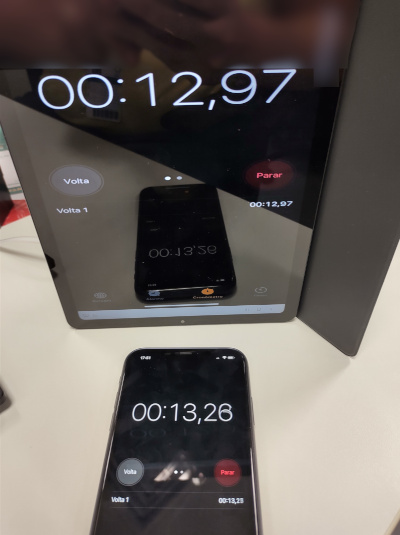

# Introduction

This is a Android low latency Airplay server.

`Airplay2` is a new feature added by Apple in `iOS11.3` for LAN and video and audio delivery.

`AirplayServer` as the receiving end, can receive data from the support `Airplay2` device

`AirplayServer` can run on `Android` device, code 99% is written in C language, easy to port

# Features

1. mDNS publishing service
2. Handshake agreement
3. Receive mirror data
4. MediaCodec hard solution and display
5. Receive audio data
6. fdk-aac audio decoding
7. AudioTrack plays PCM music

# Show Screenshot

